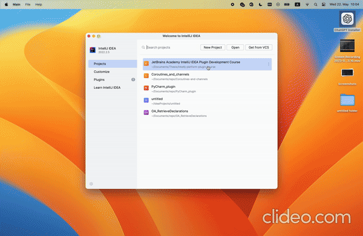

# GitProfile
Git Profile is a plugin that would allow the user to see an individual profile of a Git repository contributor based on their commit history.

# How to install
1) clone the repository
2) set-up your own `GitHub API` token
3) open `git_profile` project in IntelliJ IDEA
4) Run Plugin
